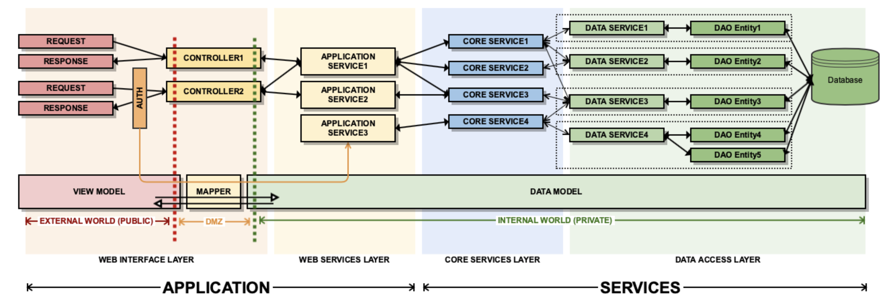

# Project Structure

## Diagram

## APPLICATION
Components
* Controllers
  * View Models
* Validators
* Exception Handler
* Authorization
* Configurations

### Controller
Responsibility
0. Receive request
0. Validate
0. Map to Data Model
0. Call service
0. Get result
0. Map to View Model
0. Sent Response

### API / Web Service
Aggregated layer where could be implemented WebApp related logic.

## SERVICES
Components
* Data Models
* Core Services
* Data Services
* Exceptions (checked)
* Utilities / Helpers
* Configurations
